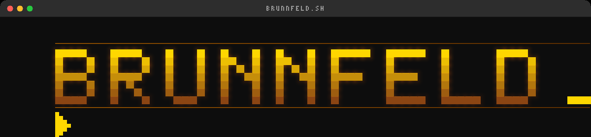
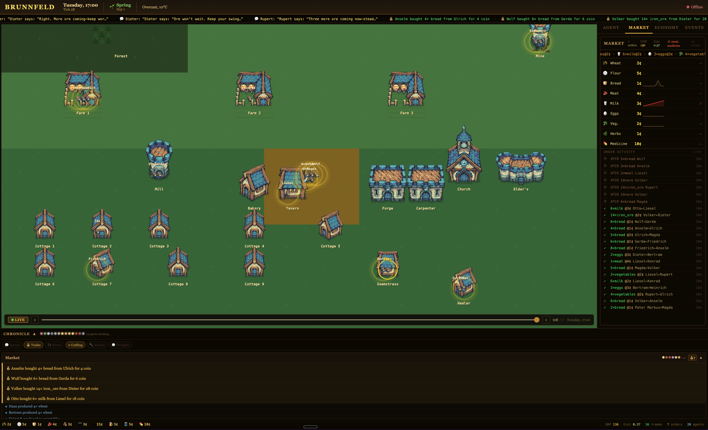
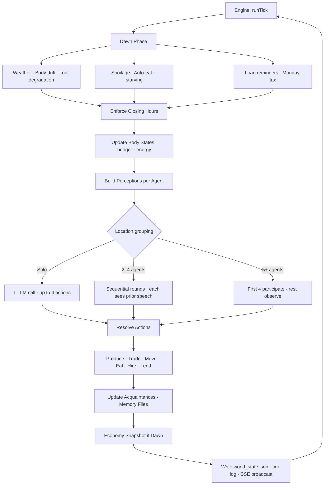
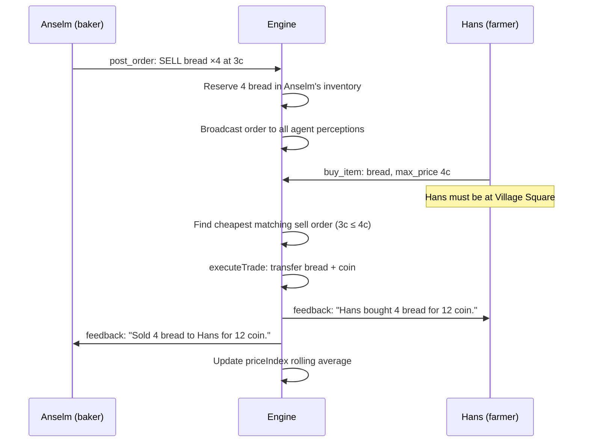
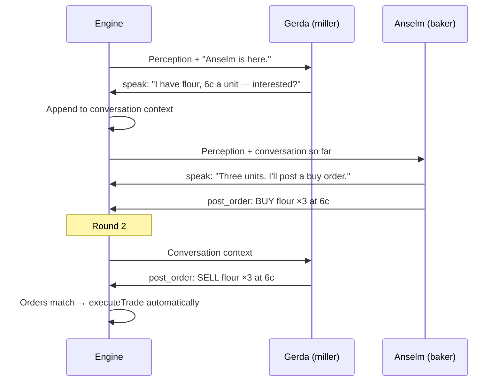

# Brunnfeld 🌾



[](https://nodejs.org)
[](https://www.typescriptlang.org)
[](./LICENSE)
[](https://openrouter.ai)



**A medieval village economy that runs itself.**

Up to 1000 LLM agents live in a 22-location village. They receive no behavioral instructions, no trading strategies, no economic goals. Each agent gets a short background — name, skill, home, starting goods — and a structured world that enforces physics: hunger, tool degradation, seasonal yields, locked doors, expiring orders, spoiling food, debt.

The agents produce interesting economic behavior because two things collide: what the LLM already knows about the world, and what the engine will actually allow. The LLM knows what a miller does. The engine enforces that only Gerda has the skill and the location. Neither alone produces what you see — pretraining without constraints is generic roleplay; constraints without pretraining is random noise. Together, they produce a miller who actually blocks bread production when she stops coming to market.

**What makes it different:**

- **No behavioral instructions** — agents receive only a structured world state, not goals or strategies
- **Hard supply chains** — wheat → mill → flour → bakery → bread; one missing link halts production
- **Real economics** — live order book, rolling price index, tool degradation, spoilage, seasonal yields, debt
- **Village governance** — pressure accumulates in the elder's perception until he calls a meeting; council votes pass laws that take immediate effect
- **Persistent memory** — each agent's markdown file is written by the engine and read back every turn
- **Scalable** — generate worlds with up to 1000 agents across 5 villages via a single API call

---

## Quick Start

```bash
git clone https://github.com/marcopatzelt/brunnfeld
cd brunnfeld
npm install
cp .env.example .env    # add OPENROUTER_API_KEY, or leave blank to use Claude CLI
npm start               # streams live to http://localhost:3333
```

Reset to tick 1 at any time:

```bash
npm run reset && npm start
```

Full setup options (LLM backends, model recommendations, env vars) → [Setup](#setup)

---

> **The key insight**: LLM agents behave like the people they know how to be — millers mill, bakers bake — but without a physics layer those are just words. Brunnfeld's engine enforces that *only Gerda has the skill and the location*. Neither alone is interesting. Together they produce a miller who actually blocks bread production when she stops coming to market.

---

## How It Works

### The Core Loop

Every simulated hour, the engine builds a perception for each agent, calls the LLM, and resolves the returned actions against world state.



The agent sees the world. The agent acts. The engine resolves. That's it.

### What the Agent Actually Receives

This is the **entire prompt** for one agent turn. No system prompt. No strategy instructions.

```
You are Anselm.

[3-sentence profile from data/profiles/anselm.md]

Locations in the village: Village Square, Bakery, Mill, Tavern, ...

[memory file: People · Experiences · Important]

---

Spring, Monday 08:00. Bakery. Day 1/7.
Weather: Clear, 12°C.

Gerda is here.
(You're hungry.)
Inventory: flour ×2, bread ×3
Wallet: 32 coin
Tools: Rolling Pin — 87% durability

You can produce here:
- produce "bread" → 4 bread [ready now]

Marketplace board:
  SELL: wheat ×8 at 2c (by Hans, expires in 15 ticks)
  WANT: flour ×3, paying up to 6c (Gerda)

IMPORTANT: Your wallet and inventory shown above are exact.
Verbal agreements do not transfer goods — only post_order
and buy_item create actual trades.

{ "actions": [...] }
```

That's **~300 tokens of structure** plus memory. No "you are a profit-seeking merchant." No "you should sell bread when prices are high." The environment creates those behaviors:

- Anselm has flour → he can produce bread right now
- Gerda wants flour at 6c and is standing next to him → he can negotiate
- He's hungry → he might eat his own bread before selling it

Everything the agent *can do* comes from what the engine allows. Whether it *does* those things, and in what order, comes from the LLM. The engine is the economy. The LLM is the person living in it.

---

## The Architecture

### Engine vs. Agent: Who Controls What

```
┌─────────────────────────────┐     perception      ┌─────────────────────┐     JSON actions     ┌─────────────────────────────┐
│        ENGINE               │ ──────────────────► │    AGENT (LLM)      │ ───────────────────► │       RESOLUTION            │
│      (deterministic)        │                     │    (single call)    │                      │      (deterministic)        │
│                             │                     │                     │                      │                             │
│  · Time · Season · Weather  │                     │  · Choose action    │                      │  · Validate world rules     │
│  · Hunger · Energy · Sleep  │                     │  · Speak · Produce  │                      │  · Update inventory/wallet  │
│  · Opening hours · Routing  │ ◄───────────────────│  · Trade · Move     │                      │  · Write memory file        │
│  · Tool degradation         │    state changes    │  · Negotiate prices │                      │  · Emit SSE events          │
│  · Order book · Spoilage    │                     │  · Form alliances   │                      │                             │
│  · Recipe validation        │                     │                     │                      └─────────────────────────────┘
│  · Loans · Tax · Death      │                     └─────────────────────┘
└─────────────────────────────┘
```

The split is intentional. The engine handles **everything that would otherwise require instructing the agent**:

| Without engine enforcement | With engine enforcement |
|---|---|
| "Only produce items matching your skill" | Recipe validator checks skill + location + inputs + tool |
| "You should eat when hungry" | `(You're hungry.)` + cheapest food hint injected into perception |
| "Don't go to closed locations" | Closing-hour enforcement ejects agents, sends them home |
| "Remember what you traded yesterday" | Memory file rebuilt from actions each tick |
| "Wheat needs milling before baking" | `[Can't eat] Wheat must be milled into flour first` |
| "Post competitive prices" | Agents see the full live order book — market pressure is visible |
| "Your tools will break if you don't replace them" | Tool durability shown in perception; broken tools block production |

Every row is a **prompt instruction that was never written** because the engine handles it structurally.

### The 14-Phase Tick

```
1 tick = 1 simulated hour, 6am–9pm (16 ticks/day)
Night is skipped: body resets, sleep memory injected

Tick 1   = Spring, Monday 6am, Day 1
Tick 16  = Spring, Monday 9pm
Tick 17  = Spring, Tuesday 6am
Tick 112 = Spring, Sunday 9pm
Tick 113 = Summer, Monday 6am  (new season)
Tick 448 = Winter, Sunday 9pm  (end of year 1)
```

Each `runTick()` executes in order:

1. **Dawn phase** (first tick of day only): weather update, auto-eat starving agents, degrade tools, check food spoilage, clean expired notes, pay loan reminders, Monday tax collection by Otto (10% from all agents), auto-schedule daily village assembly
2. **Enforce closing hours** — eject agents from closed locations, route home
3. **Update body states** — hunger +1 every 4 hours, energy decay after 2pm
4. **Clear last tick's feedback** — save for perception, reset for next tick
5. **God Mode events** — expire events, apply bandit theft, expire old petitions
6. **Player turn** — process any queued player actions immediately
7. **Banishment enforcement** — move banned agents to Prison, release expired bans
8. **Village meeting phase** — if a meeting is scheduled for this tick, run quorum check, discussion rounds, vote, and resolution before any normal agent turns. Attendees are excluded from step 10.
9. **Pre-meeting nudge** — if a meeting is scheduled next tick, inject `[URGENT]` feedback to all agents
10. **Build perceptions** — full perception string per alive non-meeting agent; Otto's perception additionally receives `[Village concern]` and `[Petition]` lines computed from world state
11. **Decision phase** — group by location, run LLM calls (solo / multi-agent rounds)
12. **Social resolution** — apply moves, build acquaintances from co-location speech
13. **Production resolution** — validate and execute produce actions
14. **Marketplace resolution** — post_order, cancel_order, expire stale orders
15. **Economic checks** — starvation check (death at tick 3 of hunger=5)
16. **Memory update** — write agent markdown files (experiences, people, important)
17. **Economy snapshot** (first tick of day) — wealth, Gini, GDP, scarcity
18. **Write state** — persist world_state.json to disk
19. **Write tick log + SSE broadcast** — stream to web viewer; meeting ticks include full `meeting` field with discussion, votes, and outcome

### Perception Builder

The engine constructs each agent's perception from world state. The agent never reads world state directly.

```
world_state.json
      │
      ▼
┌─────────────────────┐
│  Perception Builder │
└─────────────────────┘
      │
      ├─ Time ·············· "Spring, Monday 08:00, Day 1/7"
      ├─ Location ·········· "Bakery"
      ├─ Weather ··········· "Clear, 12°C"
      ├─ Others ··········· "Gerda is here."
      ├─ Body ·············· "(You're hungry.)"
      ├─ Inventory ········· "flour ×2, bread ×3 (1 reserved)"
      ├─ Wallet ············ "32 coin"
      ├─ Loans ············· "You owe 10c to Hans (due day 7)"
      ├─ Producible ········ "- produce bread → 4 bread [ready now]"
      ├─ Marketplace ······· "SELL: wheat ×8 at 2c (Hans)..."
      ├─ Messages ·········· "From Hans: do you have any bread?"
      └─ Feedback ·········· "[No match] Cheapest bread: 3c from Anselm."
            │
            ▼
     Perception String → Agent Prompt
```

Key design decisions:

- **Acquaintance gating**: Agents who haven't spoken don't know each other by name. The engine substitutes `"the miller from the Mill"` until they've spoken.
- **Feedback injection**: Failed actions return `[Can't do that] reason` into the next perception. Agents learn from rejection without any instruction.
- **Supply chain hints**: When a hungry agent tries to eat raw wheat, the engine returns `[Can't eat] Wheat must be milled into flour (at the Mill) then baked into bread (at the Bakery).`
- **Hunger routing**: When an agent has no food and no market food exists, the engine injects specialist knowledge — which villagers sell food, their current location, whether they're home.

---

## The Village

```
Brunnfeld

┌─────────────────────────────────────────────┐
│  Resources    │  Forest · Mine               │
│               │  Farm 1 · Farm 2 · Farm 3    │
├───────────────┼─────────────────────────────┤
│  Production   │  Mill (7am–4pm)              │
│               │  Bakery (6am–2pm)            │
│               │  Forge (7am–4pm)             │
│               │  Carpenter Shop (7am–4pm)    │
│               │  Seamstress Cottage          │
│               │  Healer's Hut (7am–5pm)      │
├───────────────┼─────────────────────────────┤
│  Commerce     │  Village Square (always)     │
│               │  Tavern (10am–9pm)           │
├───────────────┼─────────────────────────────┤
│  Commerce     │  Merchant Camp (caravan only)│
├───────────────┼─────────────────────────────┤
│  Governance   │  Town Hall                   │
│               │  Elder's House               │
│               │  Prison                      │
├───────────────┼─────────────────────────────┤
│  Residential  │  Cottages 1–9                │
└───────────────┴─────────────────────────────┘

All trade happens at Village Square.
Non-adjacent moves route through Village Square (2 ticks).
```

### The 19 Agents

| Agent | Skill | Home | Starting Coin | Role |
|-------|-------|------|--------------|------|
| **Hans** ★ | farmer | Farm 1 | 30c | Primary wheat producer |
| **Heinrich** | farmer | Farm 1 | 25c | Wheat + eggs |
| **Ulrich** | farmer | Farm 3 | 20c | Vegetables |
| **Bertram** | farmer | Farm 1 | 15c | Wheat (subsistence) |
| **Konrad** | cattle | Farm 2 | 40c | Milk + meat |
| **Gerda** ★ | miller | Mill | 45c | Wheat → flour (sole supplier) |
| **Anselm** ★ | baker | Bakery | 32c | Flour → bread (sole supplier) |
| **Liesel** | tavern | Tavern | 55c | Ale + meals |
| **Volker** ★ | blacksmith | Forge | 60c | Iron ore + coal → tools |
| **Wulf** | carpenter | Carpenter Shop | 35c | Timber → furniture |
| **Friedrich** | woodcutter | Cottage 7 | 22c | Timber + firewood |
| **Dieter** | miner | Cottage 8 | 18c | Iron ore + coal |
| **Rupert** | miner | Cottage 3 | 20c | Iron ore + coal |
| **Sybille** | healer | Healer's Hut | 28c | Herbs → medicine |
| **Elke** | seamstress | Seamstress Cottage | 30c | Cloth production |
| **Ida** | — | Cottage 2 | 12c | No production skill |
| **Magda** | — | Cottage 8 | 10c | No production skill |
| **Otto** ★ | elder | Elder's House | 120c | Tax collector (10% every Monday); chairs the village council |
| **Pater Markus** | priest | Town Hall | 25c | No economic role |

★ = village council member

**Pre-existing acquaintances** (day 1): Hans↔Heinrich, Gerda↔Anselm, Volker↔Wulf, Friedrich↔Rupert, Dieter↔Rupert, Dieter↔Magda, Liesel↔Otto, Otto↔Pater Markus

### Supply Chains

The village has hard bottlenecks that create economic pressure without any prompting:

```
Wheat (farmers) ──→ Mill (Gerda only) ──→ Flour ──→ Bakery (Anselm only) ──→ Bread
                                                         ↑
                                               Firewood (woodcutters)

Iron Ore + Coal (miners) ──→ Forge (Volker only) ──→ Iron Tools
    ↑
  Mine

Timber (woodcutters) ──→ Carpenter Shop (Wulf only) ──→ Furniture
```

If Gerda doesn't sell flour, Anselm can't bake. If Volker doesn't make tools, farmers can't harvest. The supply chain is the motivation.

---

## The Production System

14 recipes, each locked by skill + location + inputs. Agents produce once per hour maximum.

| Item | Skill | Location | Inputs | Output | Tool required |
|------|-------|----------|--------|--------|---------------|
| wheat | farmer | Farm 1/2/3 | — | 4× | ✓ |
| vegetables | farmer | Farm 1/2/3 | — | 3× | ✓ |
| eggs | farmer | Farm 1/2/3 | — | 2× | ✗ |
| milk | cattle | Farm 2 | — | 3× | ✗ |
| meat | cattle | Farm 2 | — | 2× | ✓ |
| timber | woodcutter | Forest | — | 3× | ✓ |
| firewood | woodcutter | Forest | — | 4× | ✓ |
| iron_ore | miner | Mine | — | 3× | ✓ |
| coal | miner | Mine | — | 2× | ✓ |
| herbs | healer | Forest | — | 2× | ✗ |
| flour | miller | Mill | 3 wheat | 2× | ✗ |
| bread | baker | Bakery | 1 flour | 4× | ✗ |
| ale | tavern | Tavern | 2 wheat | 4× | ✗ |
| meal | tavern | Tavern | 1 meat + 1 veg | 3× | ✗ |
| medicine | healer | Healer's Hut | 3 herbs | 1× | ✗ |
| furniture | carpenter | Carpenter Shop | 3 timber | 1× | ✓ |
| iron_tools | blacksmith | Forge | 2 ore + 1 coal | 1× | ✗ |
| cloth | seamstress | Seamstress Cottage | — | 1× | ✗ |

**Tool system**: Tools degrade 3 durability points per use (0–100 scale). Broken tools block production. Only Volker produces `iron_tools`. If the blacksmith dies or stops producing, the whole village eventually loses production capacity.

**Seasonal yields**: Spring/Autumn are full yield. Summer benefits cattle (milk, meat). Winter disables most crop production — only miners, woodcutters, and specialists keep working.

**Spoilage**: Milk (2 days), meat (3 days). The engine removes expired items silently. No warning; agents just find their inventory shorter.

---

## The Marketplace

Every trade in Brunnfeld happens through the order book at Village Square.



**Key mechanics**:
- Orders expire after 16 ticks (1 day)
- Sell orders reserve inventory; buy orders do not reserve coin
- `buy_item` resolves immediately (not deferred), so agents can buy food and eat in the same turn
- Price index is a rolling 10-trade average per item — the market self-prices
- When `[No match]` fires, the engine tells the agent the actual cheapest available price: `Cheapest available: 5c from Anselm. Raise your max_price.`

**Economy tracking** (captured once per day at dawn):
- Total village wealth
- Gini coefficient (wealth inequality 0–1)
- GDP (sum of all trades in last 16 ticks)
- Scarcity alerts (items with <3 units on market)
- Wealth distribution per agent

---

## The Body System

Hunger and energy create natural pressure without any goal-setting prompt.

**Hunger** (0 = full, 5 = starving):
- Increases +1 every 4 simulated hours
- Slight reduction at dawn (overnight rest)
- Auto-eat fires at dawn if hunger ≥4 (cheapest available food by price index)
- Starvation: hunger=5 for 3+ consecutive ticks → agent dies (removed from simulation)

**Energy** (0–10):
- Resets each dawn: good sleep → 9, fair → 7, poor → 5
- Decays after 2pm
- Sickness ≥2 forces poor sleep → 4 energy at dawn

**Food satiation values**:

| Item | Hunger reduction |
|------|-----------------|
| meal (tavern) | −3 |
| bread, meat | −2 |
| vegetables, eggs, milk | −1 |
| ale | 0 (no hunger reduction) |
| wheat, flour | ✗ not edible |

**Health**: Sickness and injury (0–3) heal 1 point per day. Sybille produces medicine — the only treatment.

---

## The Conversation System

When 2 or more agents are at the same location, the engine runs sequential conversation rounds. Each agent sees what the others said before deciding their own action.



**Round limits**: Up to 4 rounds per location per tick. Stops early if no agent produces a visible action (speak, move, trade) in a round after round 1.

**Observer handling**: When 5+ agents are present, the first 4 are full participants. Remaining agents each get one solo round, see the full conversation, but don't add to it.

**Acquaintance formation**: Agents who speak at the same location become acquaintances. From that point on, they know each other by name. Before that: "the farmer from Farm 1."

---

## The Loan System

Agents can extend credit to each other. The engine tracks it.

Agents negotiate loans through speech and then use `give_coin` for transfers. The engine tracks the record.

```typescript
// Engine loan record (created when agents negotiate a lend_coin deal):
Loan {
  creditor: "anselm",
  debtor: "hans",
  amount: 10,
  issuedTick: 47,
  dueTick: 159,       // 7 simulated days
  repaid: false
}
```

- Overdue reminder injected into debtor's perception at dawn
- Repayment via `give_coin` (no automatic collection — agents must negotiate)
- Loan status shown in both parties' perceptions: `"You owe 10c to Anselm (due day 7)"`

---

## The Memory System

Each agent has a markdown file that the engine writes and the agent reads every turn.

```markdown
# Anselm

## People
- Gerda: reliable supplier, comes by mornings
- Hans: owes me bread money from last week

## Experiences
Spring Monday 06:00. Bakery. Produced 4 bread.
Spring Monday 08:00. Bakery. Gerda was there. Sold 3 flour for 18c.
Spring Monday 10:00. Village Square. Posted SELL bread ×4 at 3c.
Spring Monday 12:00. Bakery. You are alone. (Hungry.)
Night. Slept (well). New day.
Spring Tuesday 06:00. Bakery. Produced 4 bread.

## Important
- Hans posted a buy order for bread at 2c — too low.
```

The engine writes to this file after each tick. The agent reads it at the start of every turn. This creates a memory loop without any scaffolding:

1. Anselm sells flour to Gerda → engine writes `"Sold 3 flour for 18c"` to memory
2. Next tick, Anselm reads his memory → knows Gerda buys flour in the morning
3. Next tick Anselm reads his memory — he has what he needs to anticipate demand, though whether he acts on it is up to the LLM

**Compression**: The 20 most recent entries stay verbatim. Older entries are batch-summarized by the engine: `[Monday]: Produced bread. Traded with Gerda. Wallet +18c.` This prevents context overflow while preserving economic history.

---

## The Action Schema

Agents respond with a JSON array of actions. The engine validates each one against world state.

The schema is **contextual** — agents only see actions that are relevant to their current situation. The core schema has 11 actions. Governance actions are injected only when conditions apply.

**Core actions (every tick):**

```json
{ "actions": [
    { "type": "think",        "text": "flour running low" },
    { "type": "speak",        "text": "Gerda, I need three units by tomorrow." },
    { "type": "move_to",      "location": "Village Square" },
    { "type": "produce",      "item": "bread" },
    { "type": "eat",          "item": "bread", "quantity": 1 },
    { "type": "post_order",   "side": "sell", "item": "bread", "quantity": 4, "price": 3 },
    { "type": "buy_item",     "item": "flour", "max_price": 6 },
    { "type": "cancel_order", "order_id": "ord_001" },
    { "type": "send_message", "to": "Hans", "text": "Do you have wheat to sell?" },
    { "type": "give_coin",    "to": "Gerda", "amount": 10 },
    { "type": "steal",        "target": "Anselm", "item": "bread" }
]}
```

**Governance actions (contextual):**

| Action | Appears when |
|--------|-------------|
| `call_meeting` | Otto only, when village concerns are active |
| `petition_meeting` | Non-Otto agents, when village concerns are active |
| `propose_rule` | At Town Hall during a meeting discussion phase |
| `vote` | At Town Hall during a meeting vote phase |

**Action constraints the engine enforces**:

| Action | Rejection condition |
|--------|-------------------|
| `produce "bread"` | Wrong location · wrong skill · missing inputs · broken tool |
| `buy_item "bread"` | Not at Village Square · no matching sell order · insufficient coin |
| `move_to "Bakery"` | Bakery closed (after 2pm) · already moved this tick |
| `speak "..."` | Nobody else at location |
| `eat "wheat"` | `[Can't eat] Wheat must be milled into flour first` |
| `steal` | May fail silently · or fire `[Caught stealing]` into both parties' perceptions |

All rejections return as `[Can't do that] reason` in the next tick's perception. The agents learn from failed actions without being taught.

---

## Village Governance

Meetings emerge from real village pressure — the engine doesn't schedule them; the environment creates the conditions that make them necessary.

### Village Concerns

Every tick the engine scans world state and generates concern lines that are injected **only into Otto's perception**:

```
[Village concern] 4 villagers have broken tools and cannot produce: Hans, Ulrich, Bertram, Heinrich.
[Village concern] 3 villagers are going hungry.
[Village concern] No food is listed on the marketplace — 3 hungry villagers have nowhere to buy.
[Village concern] Volker holds 34% of all village coin (180c of 530c total).
[Petition] Hans: "We need a meeting about tool scarcity — farmers cannot work"
[Petition] Ulrich: "Volker won't sell tools at fair prices. This is a crisis."
```

Otto sees the pressure. He decides whether it warrants a meeting. The engine doesn't tell him to act.

**Concern thresholds**:

| Concern | Threshold |
|---------|-----------|
| Broken tools | 2+ agents with 0% durability |
| Critical tools | 3+ agents with ≤20% durability |
| Hunger | 2+ agents dangerously hungry (4/5) or 3+ moderately hungry (3/5) |
| Food drought | No food on marketplace + 2+ hungry agents |
| Poverty | 3+ agents with fewer than 3 coin |
| Wealth concentration | One agent holds 30%+ of all village coin |

### Petitions

Any non-Otto agent can use `petition_meeting` to send a formal request to Otto. Petitions appear in his perception for 1 in-game day (16 ticks). If multiple agents petition on the same topic independently, Otto sees the pattern and can act.

### The Village Council

Five seats are held by the trades the village cannot function without: Otto (chair), Gerda (miller), Anselm (baker), Volker (blacksmith), and Hans (senior farmer). The council is a structural fact — the seats are embedded in their profiles, not elected.

The engine summons council members the evening before each meeting:
```
[Council duty] Village council meets tomorrow at dawn at the Town Hall. Your attendance is required.
```

Council members know the meeting is their responsibility. Whether they actually show up is up to the LLM.

### Village Meetings

Otto calls a meeting with `call_meeting` (scheduled for next dawn). God Mode can also trigger an emergency meeting that teleports all agents to the Town Hall immediately. After each meeting concludes, the next daily assembly is automatically scheduled.

**Meeting flow**:

1. **Quorum check** — At least 3 of 5 council members must be at Town Hall. If fewer attend, the meeting fails. General villagers may also be present but do not count toward quorum.
2. **Discussion** — 3 rounds with up to 5 participants (council members go first, then general attendees fill remaining slots). Agents speak their mind; anyone can `propose_rule` with a concrete text and optional numeric value.
3. **Vote** — All attendees vote `agree` or `disagree` on the first proposal. Needs a simple majority + 1 of total attendees to pass.
4. **Resolution** — Passed laws take immediate effect: tax rate changes, marketplace hours adjust, agents are banished to Prison.

Meeting attendees are **excluded from normal tick processing** while the meeting runs — they can't farm or trade during a meeting. The full discussion, vote breakdown, and outcome are recorded in the tick log under the `meeting` field.

**Active laws** persist across ticks and are shown to all agents in their perception.

### Banishment

If a banishment vote passes, the target is moved to Prison for a fixed duration (set by the law's value). Banned agents are force-routed to Prison each tick and released when the term expires.

## Seasons & Weather

**Year structure**: 4 seasons × 7 days = 28-day year. Each season has a 7-day weather cycle.

| Season | Temperature | Notes |
|--------|-------------|-------|
| Spring | 9–14°C | Full agricultural yield; simulation starts here |
| Summer | 18–25°C | Peak cattle output; reduced timber |
| Autumn | 5–10°C | Harvest season; similar to Spring |
| Winter | −8 to 0°C | Crop production fails; only miners, woodcutters, specialists work |

**Production multipliers**: The engine applies season coefficients to output quantities. A farmer trying to harvest wheat in winter sees `[Can't produce] wheat is not available in winter.`

---

## What Emerges

These patterns arise from structural constraints colliding with LLM priors — not from instructions, and not from the constraints alone:

**1. The miller becomes a power broker** — Gerda is the only agent who can convert wheat to flour. Anselm needs flour to bake. If Gerda doesn't come to the marketplace, bread production stops. Her structural position creates a bottleneck the engine enforces — whether she exercises leverage through pricing is up to the LLM.

**2. Tool collapse cascades** — Tools degrade 3 points per use. Volker (blacksmith) is the only source of new tools. If he runs out of ore, or stops selling, farmers lose production capacity over time. Tool scarcity spreads through the supply chain.

**3. Otto's Monday tax redistributes wealth** — 10% of every agent's wallet moves to Otto every week. This slowly impoverishes low-earners and enriches the richest agent. No agent is told this happens; it's just in the world state.

**4. Starvation is a coordination problem** — Hungry agents with no food must find a seller, go to Village Square, and have coin. All three can fail simultaneously. Agents who built no trading relationships during productive ticks have no one to ask when hungry.

**5. Agents who die change the supply chain** — If Anselm starves, bread production stops. If Gerda dies, flour stops. The simulation has no safety nets. Death is permanent. The village can collapse.

**6. Village governance emerges from scarcity** — Otto's perception accumulates `[Village concern]` lines as real thresholds are crossed: broken tools, hunger, poverty, wealth concentration. Other agents can file petitions. When enough pressure builds, Otto calls a meeting. The meeting outcome — a tax change, a forced sale, a banishment — feeds back into the supply chain the next tick.

---

## Setup

### Prerequisites

- Node.js 18+
- Either a Claude Code CLI installation **or** an OpenRouter API key

### Quick Start

```bash
git clone <repo>
cd brunnfeld
npm install
cp .env.example .env
# Configure your LLM backend (see below)
npm start
```

If you want the Web UI:

```bash
cd viewer
npm install
npm run build
```

The simulation starts at tick 1 (Spring, Monday 6am) and streams live to `http://localhost:3333`.

---

### LLM Backend

Brunnfeld supports two backends. Pick one.

#### Option A — Claude Code CLI (no API key needed)

If you have [Claude Code](https://claude.ai/code) installed and authenticated, you're done. Leave `OPENROUTER_API_KEY` unset in `.env` and the simulation uses the `claude` CLI directly.

```env
# .env — CLI mode (default)
CHARACTER_MODEL=haiku       # haiku · sonnet · opus
INTERVIEW_MODEL=haiku
```

The CLI mode does **not** stream tokens live to the viewer — agent responses appear after the full turn completes.

#### Option B — OpenRouter (live streaming)

Set `OPENROUTER_API_KEY` and the simulation switches to OpenRouter automatically. Every agent token streams live to the viewer as it's generated.

```env
# .env — OpenRouter mode
OPENROUTER_API_KEY=sk-or-...
CHARACTER_MODEL=minimax/minimax-m2.5:free
INTERVIEW_MODEL=minimax/minimax-m2.5:free
```

To use free models, go to [openrouter.ai/settings/privacy](https://openrouter.ai/settings/privacy) and enable:
- **"Enable free endpoints that may train on inputs"**
- **"Enable free endpoints that may publish prompts"**

**Recommended OpenRouter models:**

| Model | Input $/M | Output $/M | Notes |
|---|---|---|---|
| `minimax/minimax-m2.5:free` | $0 | $0 | Free — requires privacy opt-in above |
| `minimax/minimax-m2.5` | $0.20 | $1.20 | Best value paid — ~$0.05/tick |
| `minimax/minimax-m2.7` | $0.30 | $1.20 | Newest MiniMax, multi-agent focused |
| `google/gemini-2.5-flash` | $0.30 | $2.50 | 1M context, fast |
| `deepseek/deepseek-v3.2` | $0.26 | $0.38 | Extremely cheap, strong reasoning |
| `meta-llama/llama-3.3-70b-instruct:free` | $0 | $0 | Free Llama — rate-limited at 20 req/min |
| `anthropic/claude-haiku-4-5` | $1.00 | $5.00 | Original Haiku via OpenRouter |
| `anthropic/claude-sonnet-4-6` | $3.00 | $15.00 | Best quality, highest cost |

**Cost per tick** (45 agent calls, ~2K input / ~600 output tokens each):

| Model | ~Cost/tick | ~Cost/sim week |
|---|---|---|
| Free models | $0 | $0 |
| minimax-m2.5 | ~$0.05 | ~$5.60 |
| deepseek-v3.2 | ~$0.03 | ~$3.00 |
| claude-haiku-4-5 | ~$0.23 | ~$25 |
| claude-sonnet-4-6 | ~$1.50 | ~$168 |

---

### Commands

| Command | Description |
|---------|-------------|
| `npm start` | Build viewer + start simulation from tick 1 |
| `npm run resume` | Build viewer + continue from last saved tick |
| `npm run dev` | Build viewer + start from tick 1 (alias) |
| `npm run dev:resume` | Build viewer + resume (alias) |
| `npm run tick` | Run exactly one tick |
| `npm run reset` | Wipe state, restore initial memories |
| `npm run server` | Start HTTP server only (viewer, no simulation) |
| `npm run typecheck` | TypeScript check |

### Environment Variables

| Variable | Default | Description |
|----------|---------|-------------|
| `OPENROUTER_API_KEY` | — | If set, enables OpenRouter backend with live streaming |
| `CHARACTER_MODEL` | `haiku` | Model for village agents. Any OpenRouter model ID or `haiku`/`sonnet`/`opus` for CLI |
| `INTERVIEW_MODEL` | `haiku` | Model for the agent interview endpoint |
| `CLAUDE_CONCURRENCY` | `4` | Max parallel LLM calls |
| `PORT` | `3333` | HTTP server port |

---

## Project Structure

```
brunnfeld/
├── src/
│   ├── engine.ts              # Main loop — 14-phase runTick()
│   ├── agent-runner.ts        # Perception builder · LLM calls · action dispatch
│   ├── tools.ts               # Action schema + inline resolution
│   ├── types.ts               # WorldState · AgentAction · Loan · all interfaces
│   ├── index.ts               # CLI · initWorldState · reset logic
│   ├── production.ts          # Recipe registry · production resolution
│   ├── marketplace.ts         # Order book · price index · trade execution
│   ├── marketplace-resolver.ts # post_order · cancel_order resolution
│   ├── body.ts                # Hunger · energy · starvation · auto-eat
│   ├── inventory.ts           # Item management · spoilage · reservation
│   ├── memory.ts              # Agent markdown I/O · compression · migration
│   ├── time.ts                # Tick ↔ SimTime conversion
│   ├── village-map.ts         # Locations · adjacency · opening hours
│   ├── events.ts              # SSE EventEmitter
│   ├── server.ts              # HTTP server · /api routes · static viewer
│   ├── llm.ts                 # OpenRouter + Claude CLI · streaming · <think> stripping
│   ├── god-mode.ts            # God Mode events · agent interview · whisper · meeting trigger
│   ├── village-concerns.ts    # Village concern computation injected into Otto's perception
│   ├── messages.ts            # send_message queuing
│   ├── doors.ts               # lock / unlock / knock resolution
│   ├── player.ts              # Player init · immediate action resolution · soft death revive
│   └── tools-degradation.ts   # Tool wear tracking
├── viewer/                    # Web viewer (Vite + React + Canvas)
│   └── src/
│       ├── canvas/            # Pixel art renderer: map · agents · decorations · animations
│       ├── components/        # AgentPanel · MarketPanel · EconomyPanel · GodModePanel
│       │                      # CharacterCreation · PlayerHUD · Feed
│       └── hooks/             # SSE connection · state management (Zustand)
├── data/
│   ├── world_state.json       # Full simulation state (mutated every tick)
│   ├── profiles/              # Agent background files (read-only, ~5 sentences each)
│   ├── memory/                # Live agent memory files (written every tick)
│   ├── memory_initial/        # Clean memory templates (restored on reset)
│   └── logs/                  # Per-tick JSON logs (tick_00001.json, ...)
```

### Web Viewer API

| Endpoint | Method | Returns |
|----------|--------|---------|
| `GET /api/state` | GET | Full current world state |
| `GET /api/economy` | GET | Economy snapshots array |
| `GET /api/marketplace` | GET | Current order book + price index |
| `GET /api/trades` | GET | Full trade history |
| `GET /api/prices` | GET | Current price index |
| `GET /api/memories` | GET | All agent memory files |
| `GET /api/profiles` | GET | All agent profile files |
| `GET /api/ticks` | GET | List of available tick log IDs |
| `GET /api/tick/:id` | GET | Single tick log (locations, trades, productions, movements, meeting?) |
| `GET /stream` | GET | SSE stream of live simulation events |
| `POST /api/events/trigger` | POST | Inject a god mode event `{ eventType }` |
| `POST /api/events/trigger-meeting` | POST | Call emergency village meeting `{ agendaType, description, target? }` |
| `POST /api/interview/:agent` | POST | Stream in-character agent response `{ question }` |
| `POST /api/whisper/:agent` | POST | Queue a message to an agent `{ message }` |
| `POST /api/player/create` | POST | Create player character `{ name, skill, location }` |
| `POST /api/player/action` | POST | Execute a player action immediately `{ action }` |
| `DELETE /api/player/action` | DELETE | Clear any pending player actions |

**Player action types** (all execute immediately, no tick wait):

```bash
# Move
curl -X POST localhost:3333/api/player/action \
  -H 'Content-Type: application/json' \
  -d '{"action":{"type":"move_to","location":"Village Square"}}'

# Produce
curl -X POST localhost:3333/api/player/action \
  -d '{"action":{"type":"produce","item":"iron_ore"}}'

# Buy from marketplace
curl -X POST localhost:3333/api/player/action \
  -d '{"action":{"type":"buy_item","item":"bread","max_price":9999}}'

# Post a sell order
curl -X POST localhost:3333/api/player/action \
  -d '{"action":{"type":"post_order","side":"sell","item":"iron_ore","quantity":3,"price":4}}'

# Eat
curl -X POST localhost:3333/api/player/action \
  -d '{"action":{"type":"eat","item":"bread","quantity":1}}'
```

**SSE event types**: `tick`, `action`, `trade`, `production`, `economy`, `order`, `thinking`, `stream`, `event`, `event_expired`, `player:created`, `player:update`, `player:revived`

---

## Playing as a Villager

You can join the simulation as a playable character and compete against the 20 NPC agents to earn more coin.

### Character Creation

When you open the viewer before creating a character, a full-screen creation overlay appears. Pick a name, a skill, and a starting location — or click **Just Watch** to observe without playing.

| Skill | Starting Coin | Work Location | Produces |
|-------|:---:|---|---|
| Farmer | 20c | Farm 1 | wheat, vegetables, eggs |
| Baker | 20c | Bakery | bread (needs flour) |
| Miner | 20c | Mine | iron_ore, coal |
| Carpenter | 20c | Carpenter Shop | furniture (needs timber) |
| Blacksmith | 20c | Forge | iron_tools (needs iron_ore + coal) |
| Merchant | 30c | Village Square | nothing — trade only |

### The Player HUD

Once created, a 200px sidebar appears on the left with:

```
┌──────────────────┐
│ Klaus            │  name + skill + location
│ Miner · Mine     │
│ 20c              │  wallet
│ ████░ Hunger     │  5-bar indicators
│ ████████░ Energy │
├──────────────────┤
│ ACT NOW          │
│ [Move To ▼]  Go  │  instant teleport + walk animation
│ [Produce ▼] Do   │  craft immediately
│ [Buy Item ▼] Buy │  buy from marketplace now
│ [Post Order]     │  list item for sale
│ [Eat (bread)]    │  eat from inventory
│ [Rest]           │
├──────────────────┤
│ INVENTORY        │
│ iron_ore ×3      │
├──────────────────┤
│ LEADERBOARD      │
│ 1. Hans   142c   │
│ 2. Ida    118c   │
│ 3. You     23c ← │
└──────────────────┘
```

### Immediate Actions

All player actions execute **instantly** when you click — no waiting for the next tick:

- **Move** → location updates on the map with a walk animation
- **Produce** → crafted immediately using your current location + skill
- **Buy** → marketplace trade executes right now
- **Post Order** → sell listing appears on the order board immediately
- **Eat / Rest** → hunger and energy update instantly

The engine still runs NPC ticks concurrently. Player actions are resolved against live world state the moment the button is clicked, then broadcast to the viewer via SSE.

### Soft Death

If your hunger reaches 5 for 3 consecutive ticks, Pater Markus revives you at the Healer's Hut at a cost of **−10 coin**.

---

---

## God Mode & Agent Interview

The viewer's **Events tab** lets you inject disruptions into the running simulation and watch the consequences ripple through the economy tick by tick.

### God Mode Events

| Event | Effect | Duration |
|---|---|---|
| 🌵 **Drought** | Farm yields halved | 3 sim days (48 ticks) |
| 🐪 **Caravan** | Merchant arrives with cheap goods at 70% market price | 1 sim day (16 ticks) |
| ⛏ **Mine Collapse** | Ore production blocked entirely | 2 sim days (32 ticks) |
| 🌾 **Double Harvest** | Farm yields doubled | 1 sim day (16 ticks) |
| ☠ **Plague Rumor** | Medicine demand surges, agents panic-buy | 2 sim days (32 ticks) |
| 🗡 **Bandit Threat** | 5% per-tick theft risk for all agents | 2 sim days (32 ticks) |
| 🏛 **Call Village Meeting** | Teleports all agents to Town Hall immediately; meeting fires next tick | instant |

Events broadcast a message to affected agents via the message queue, so they respond in-character next tick. Active events are shown with a live countdown in the viewer.

The **Call Village Meeting** button accepts an agenda type, description, and optional banishment target. All agents are teleported to Town Hall and the meeting fires on the next tick — quorum is guaranteed.

### Agent Interview

Click any villager → scroll to **Interview** → ask them anything. The response streams live in character, grounded in their actual memory, inventory, wallet, and current village events.

```
"Hans, how are your crops?"
→ "The wheat's been thin this week — drought hit us bad, and my tools
   are near worn through. I've twenty coin left and Volker wants twelve
   for a new set. I'll manage, God willing."
```

### Whisper

Type a rumor into the **Whisper** field while an agent is selected. They receive it as a message next tick and may act on it — adjust prices, hoard goods, warn others.

```
"Whisper to Anselm: bread prices will triple by winter"
→ Anselm receives: "A villager whispered: bread prices will triple by winter"
→ Watch his next-tick behavior
```

---

## The Viewer

The web viewer at `http://localhost:5173` (dev) or `http://localhost:3333` (production build) renders the simulation in real time:

- **Canvas map** — 22 locations, pixel-art buildings, agent sprites with walk animations
- **Terrain decorations** — rocks and bushes placed at stable seeded positions throughout the map (mine area, riverbanks, forest, farms, between cottages)
- **Day/night cycle** — darkness overlay from 6pm, lifted at dawn
- **Agent sprites** — pawn/warrior/monk sprites per role; your character uses an inverted-color samurai sprite with a gold ring
- **Right panel** — Agent detail, marketplace, economy charts, God Mode events
- **Activity drawer** — collapsible scene chronicle at the bottom
- **Economy strip** — always-visible wealth bar across the bottom

---

## The Point

Most agent setups give LLMs goals and hope economic behavior follows. This project inverts it: **build the supply chain, not the trading strategy.**

The engine enforces the physics: wheat must be milled before baking, tools degrade per use, hunger builds every four hours, bakeries close at 2pm. These constraints are real — they block actions, create scarcity, cause cascades. They're not metaphors.

The LLM brings the rest: it knows what a miller does, what starvation feels like, what unpaid debts mean. The two-line background activates those priors. You don't need to instruct Gerda to price her flour competitively — the LLM already knows that's what millers do. You just need to make flour actually necessary for bread production.

What you can't get from either alone: Hans paying Konrad 30 coin across two transactions, Konrad claiming no record of either payment, Hans threatening the village court. No pretraining pattern exists for that specific chain. It required the LLM's understanding of debt and fraud colliding with the engine's actual wallet ledger producing actual discrepancies. That's the demo.

**The honest claim**: when you build a real economy around LLMs, they do economics. Not because they discover it from first principles. Because they already know what economics looks like, and now the consequences are real.

---

## Contributing

The engine is intentionally small (~3K lines of TypeScript). Good areas to contribute:

- New production recipes or seasonal events
- Additional village archetypes (market town, mining camp, port)
- Viewer improvements (trade graph, wealth chart, agent timeline)
- New LLM backends or model configs

Open an issue before large PRs — the design constraints are load-bearing.

---

## Author

Built by **Marco Patzelt** — [marcopatzelt7@gmail.com](mailto:marcopatzelt7@gmail.com)
